# NPU 直通 I/O 适配方案

## 1. 架构对比

### 现有架构（RDMA 路径）

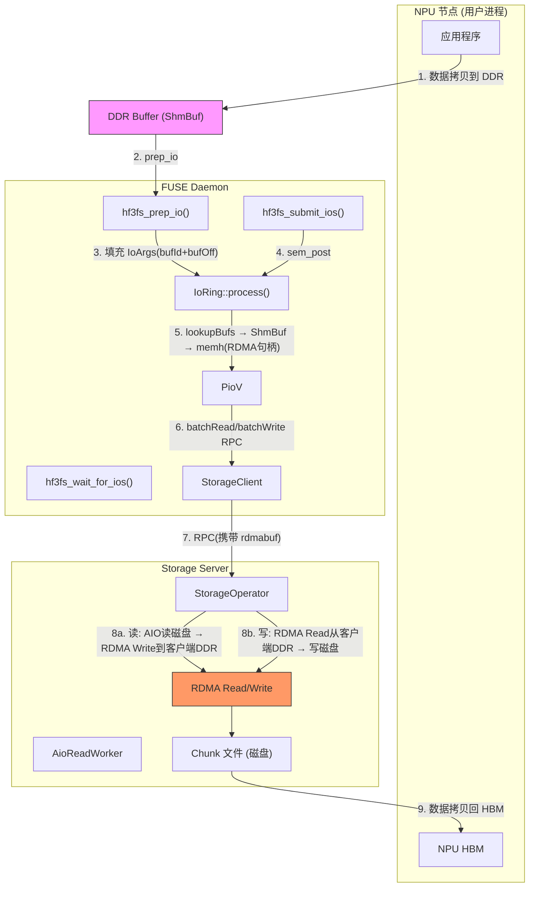

### NPU 直通架构（NDS 路径）

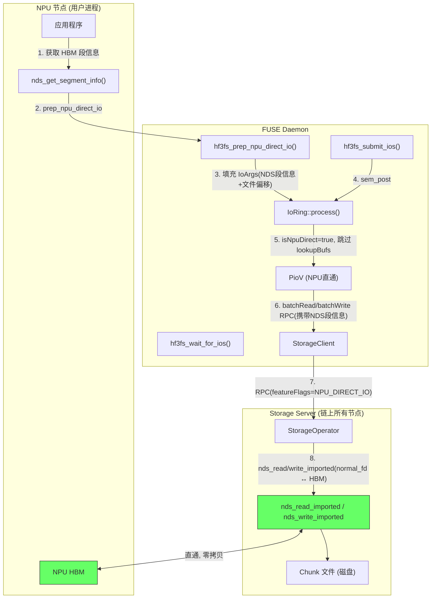

---

## 2. 端到端调用路径

### 2.1 NPU 直通读流程

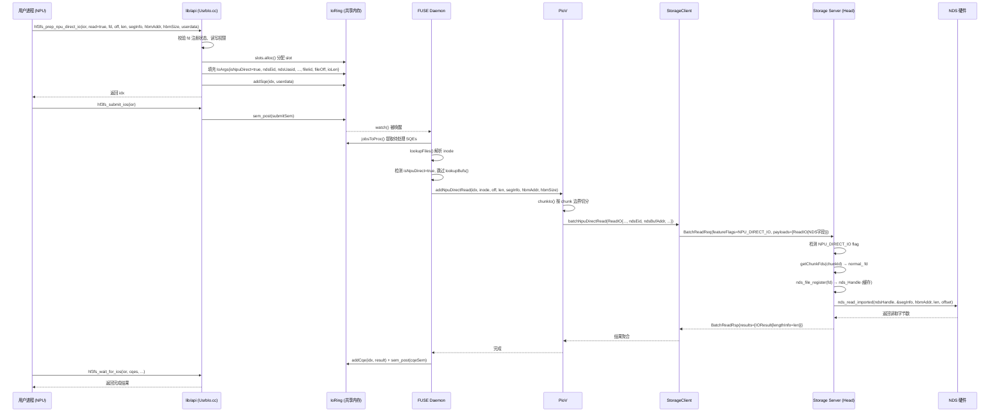

### 2.2 NPU 直通写流程（全 NDS 链路）

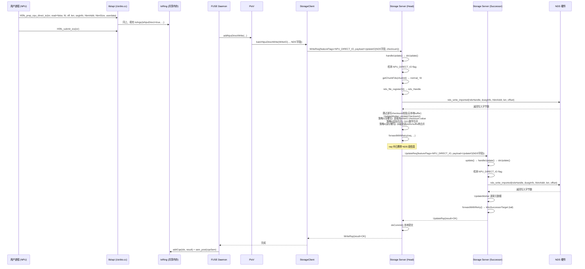

---

## 3. 数据结构变更

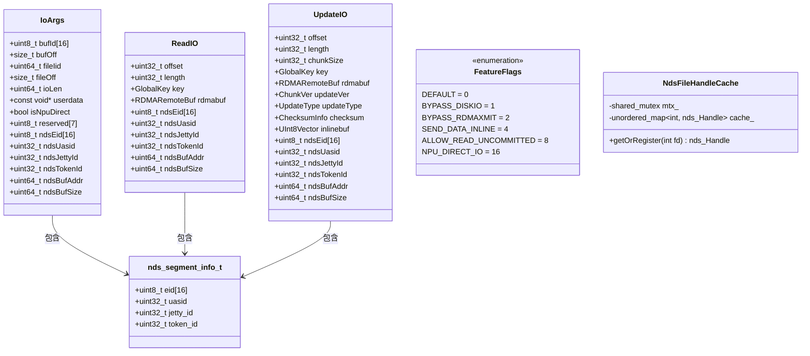

---

## 4. 链式复制对比

### 现有 RDMA 链式复制

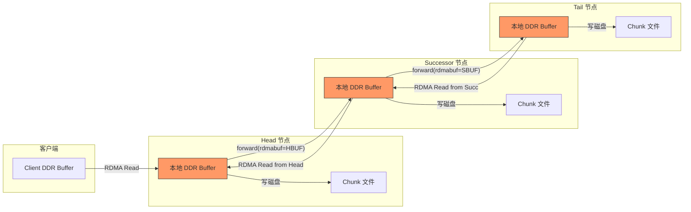

### NPU 直通全 NDS 链式复制

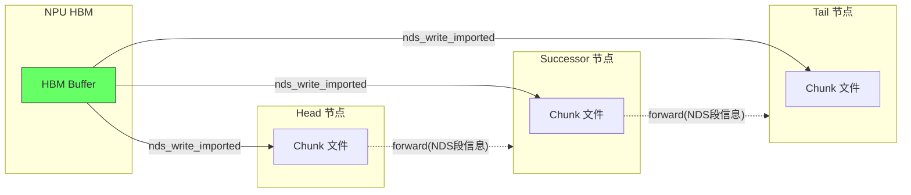

---

## 5. 改动文件清单

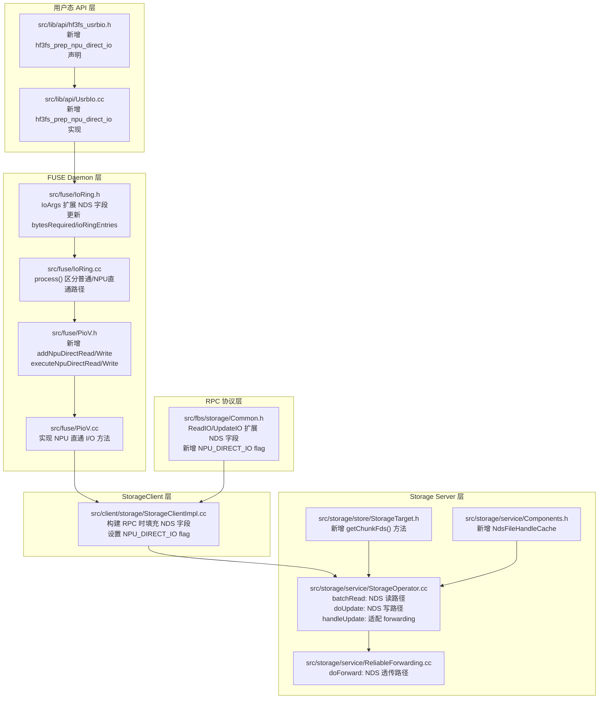

---

## 5.1 具体代码修改

### 5.1.1 `src/fuse/IoRing.h` — IoArgs 扩展 NDS 字段

**文件**: `src/fuse/IoRing.h`，第17-27行

**修改前**:
```cpp
struct IoArgs {
  uint8_t bufId[16];
  size_t bufOff;

  uint64_t fileIid;
  size_t fileOff;

  uint64_t ioLen;

  const void *userdata;
};
```

**修改后**:
```cpp
struct IoArgs {
  uint8_t bufId[16];
  size_t bufOff;

  uint64_t fileIid;
  size_t fileOff;

  uint64_t ioLen;

  const void *userdata;

  // === NPU 直通字段 ===
  bool isNpuDirect;
  uint8_t reserved[7];           // 对齐填充
  uint8_t ndsEid[16];            // NDS endpoint identifier
  uint32_t ndsUasid;             // NDS user ASID
  uint32_t ndsJettyId;           // NDS jetty ID
  uint32_t ndsTokenId;           // NDS token ID
  uint64_t ndsBufAddr;           // NPU HBM 物理地址
  uint64_t ndsBufSize;           // HBM buffer 大小
};
```

**注意**: `sizeof(IoArgs)` 变大，`bytesRequired()` 和 `ioRingEntries()` 会自动适配（因为使用了 `sizeof(IoArgs)`），无需手动修改。

---

### 5.1.2 `src/lib/api/hf3fs_usrbio.h` — 新增 API 声明

**文件**: `src/lib/api/hf3fs_usrbio.h`，在 `hf3fs_prep_io` 声明之后（第159行之后）新增：

```cpp
// NPU 直通 I/O 准备接口
// >= 0 for io index, -errno for error
// nds_segment_info: 由上层通过 nds_get_segment_info() 获取的 NDS 段信息
// nds_buf_addr: NPU HBM 物理地址
// nds_buf_size: HBM buffer 大小
int hf3fs_prep_npu_direct_io(const struct hf3fs_ior *ior,
                             bool read,
                             int fd,
                             size_t off,
                             uint64_t len,
                             void *nds_segment_info,  // nds_segment_info_t *
                             void *nds_buf_addr,      // NPU HBM 物理地址
                             uint64_t nds_buf_size,
                             const void *userdata);
```

**注意**: 由于 `hf3fs_usrbio.h` 是 C 头文件（`extern "C"`），不能直接引用 `nds_segment_info_t`。使用 `void *` 传递，在 `.cc` 中强转。

---

### 5.1.3 `src/lib/api/UsrbIo.cc` — 新增 API 实现

**文件**: `src/lib/api/UsrbIo.cc`，在 `hf3fs_prep_io` 之后（第670行之后）新增：

```cpp
int hf3fs_prep_npu_direct_io(const struct hf3fs_ior *ior,
                             bool read,
                             int fd,
                             size_t off,
                             uint64_t len,
                             void *nds_segment_info,
                             void *nds_buf_addr,
                             uint64_t nds_buf_size,
                             const void *userdata) {
  auto afd = abs(fd);
  if (!ior || !ior->iorh || read != ior->for_read || len <= 0 ||
      !nds_segment_info || !nds_buf_addr || afd >= (int)regfds.size()) {
    return -EINVAL;
  }

  auto regfd = regfds[afd].load();
  if (!regfd) {
    return -EBADF;
  }

  int status = regfd->status;
  if ((read && (status & O_ACCMODE) == O_WRONLY) ||
      (!read && (status & O_ACCMODE) == O_RDONLY)) {
    return -EACCES;
  }

  auto &iorh = *(Hf3fsIorHandle *)ior->iorh;
  auto &ring = *iorh.ior;

  auto idx = ring.slots.alloc();
  if (!idx) {
    return -EAGAIN;
  }

  auto *segInfo = static_cast<nds_segment_info_t *>(nds_segment_info);

  auto &args = ring.ringSection[*idx];
  // 填充文件信息（同普通模式）
  args.fileIid = regfd->iid.u64();
  args.fileOff = off;
  args.ioLen = len;
  args.userdata = userdata;

  // 填充 NPU 直通信息
  args.isNpuDirect = true;
  memcpy(args.ndsEid, segInfo->eid, sizeof(segInfo->eid));
  args.ndsUasid = segInfo->uasid;
  args.ndsJettyId = segInfo->jetty_id;
  args.ndsTokenId = segInfo->token_id;
  args.ndsBufAddr = (uint64_t)nds_buf_addr;
  args.ndsBufSize = nds_buf_size;

  // bufId/bufOff 在 NPU 直通模式下不使用，置零
  memset(args.bufId, 0, sizeof(args.bufId));
  args.bufOff = 0;

  auto res = ring.addSqe(*idx, userdata);
  if (!res) {
    ring.slots.dealloc(*idx);
    return -EAGAIN;
  }

  return *idx;
}
```

---

### 5.1.4 `src/fuse/IoRing.cc` — process() 区分普通/NPU直通路径

**文件**: `src/fuse/IoRing.cc`，修改 `process()` 中的 for 循环（第125-177行）。

**修改方案**: 在 for 循环内，根据 `args.isNpuDirect` 走不同分支。

**修改后的 for 循环**（替换第125-177行）:

```cpp
    for (int i = 0; i < toProc; ++i) {
      auto idx = (spt + i) % entries;
      auto sqe = sqeSection[idx];

      const auto &args = ringSection[sqe.index];

      ++iod;
      totalBytes += args.ioLen;
      distinctFiles.insert(args.fileIid);

      if (!args.isNpuDirect) {
        Uuid id;
        memcpy(id.data, args.bufId, sizeof(id.data));
        distinctBufs.insert(id);
      }

      ioSizeDist.addSample(args.ioLen, monitor::TagSet{{"io", ioType}, {"uid", uids}});

      if (!inodes[i]) {
        res[i] = -static_cast<ssize_t>(MetaCode::kNotFile);
        continue;
      }

      if (args.isNpuDirect) {
        // === NPU 直通路径 ===
        if (!forRead_) {
          auto beginWrite =
              co_await inodes[i]->beginWrite(userInfo_, *getFuseClientsInstance().metaClient, args.fileOff, args.ioLen);
          if (beginWrite.hasError()) {
            res[i] = -static_cast<ssize_t>(beginWrite.error().code());
            continue;
          }
          truncateVers[i] = *beginWrite;
        }

        nds_segment_info_t segInfo;
        memcpy(segInfo.eid, args.ndsEid, sizeof(segInfo.eid));
        segInfo.uasid = args.ndsUasid;
        segInfo.jetty_id = args.ndsJettyId;
        segInfo.token_id = args.ndsTokenId;

        auto addRes = forRead_
            ? ioExec.addNpuDirectRead(i, inodes[i]->inode, 0, args.fileOff, args.ioLen,
                                      &segInfo, (void *)args.ndsBufAddr, args.ndsBufSize)
            : ioExec.addNpuDirectWrite(i, inodes[i]->inode, 0, args.fileOff, args.ioLen,
                                       &segInfo, (void *)args.ndsBufAddr, args.ndsBufSize);
        if (!addRes) {
          res[i] = -static_cast<ssize_t>(addRes.error().code());
        }
      } else {
        // === 原有普通路径（不变）===
        if (!bufs[i]) {
          res[i] = -static_cast<ssize_t>(bufs[i].error().code());
          continue;
        }

        auto memh = co_await bufs[i]->memh(args.ioLen);
        if (!memh) {
          res[i] = -static_cast<ssize_t>(memh.error().code());
          continue;
        } else if (!bufs[i]->ptr() || !*memh) {
          XLOGF(ERR, "{} is null when doing usrbio", *memh ? "buf ptr" : "memh");
          res[i] = -static_cast<ssize_t>(ClientAgentCode::kIovShmFail);
          continue;
        }

        if (!forRead_) {
          auto beginWrite =
              co_await inodes[i]->beginWrite(userInfo_, *getFuseClientsInstance().metaClient, args.fileOff, args.ioLen);
          if (beginWrite.hasError()) {
            res[i] = -static_cast<ssize_t>(beginWrite.error().code());
            continue;
          }
          truncateVers[i] = *beginWrite;
        }

        auto addRes = forRead_
                          ? ioExec.addRead(i, inodes[i]->inode, 0, args.fileOff, args.ioLen, bufs[i]->ptr(), **memh)
                          : ioExec.addWrite(i, inodes[i]->inode, 0, args.fileOff, args.ioLen, bufs[i]->ptr(), **memh);
        if (!addRes) {
          res[i] = -static_cast<ssize_t>(addRes.error().code());
        }
      }
    }
```

**执行阶段修改**（替换第188-193行）:

```cpp
    auto readOpt = storageIo.read();
    if (flags_ & HF3FS_IOR_ALLOW_READ_UNCOMMITTED) {
      readOpt.set_allowReadUncommitted(true);
    }
    bool hasNpuDirect = ioExec.hasNpuDirectIO();
    auto execRes = hasNpuDirect
        ? co_await (forRead_ ? ioExec.executeNpuDirectRead(userInfo_, readOpt)
                             : ioExec.executeNpuDirectWrite(userInfo_, storageIo.write()))
        : co_await (forRead_ ? ioExec.executeRead(userInfo_, readOpt)
                             : ioExec.executeWrite(userInfo_, storageIo.write()));
```

---

### 5.1.5 `src/fuse/PioV.h` — 新增 NPU 直通方法声明

**文件**: `src/fuse/PioV.h`，在 `finishIo` 之前新增：

```cpp
  // NPU 直通 I/O 方法
  hf3fs::Result<Void> addNpuDirectRead(size_t idx,
                                       const meta::Inode &inode,
                                       uint16_t track,
                                       off_t off,
                                       size_t len,
                                       const nds_segment_info_t *segInfo,
                                       void *ndsBufAddr,
                                       uint64_t ndsBufSize);
  hf3fs::Result<Void> addNpuDirectWrite(size_t idx,
                                        const meta::Inode &inode,
                                        uint16_t track,
                                        off_t off,
                                        size_t len,
                                        const nds_segment_info_t *segInfo,
                                        void *ndsBufAddr,
                                        uint64_t ndsBufSize);
  CoTryTask<void> executeNpuDirectRead(const UserInfo &userInfo,
                                       const storage::client::ReadOptions &options = storage::client::ReadOptions());
  CoTryTask<void> executeNpuDirectWrite(const UserInfo &userInfo,
                                        const storage::client::WriteOptions &options = storage::client::WriteOptions());
  bool hasNpuDirectIO() const { return !npuRios_.empty() || !npuWios_.empty(); }
```

**新增私有成员**（在 `trops_` 之后）:

```cpp
  std::vector<storage::client::NpuDirectReadIO> npuRios_;
  std::vector<storage::client::NpuDirectWriteIO> npuWios_;
```

---

### 5.1.6 `src/fuse/PioV.cc` — 实现 NPU 直通方法

**文件**: `src/fuse/PioV.cc`，新增以下实现：

```cpp
hf3fs::Result<Void> PioV::addNpuDirectRead(size_t idx,
                                           const meta::Inode &inode,
                                           uint16_t track,
                                           off_t off,
                                           size_t len,
                                           const nds_segment_info_t *segInfo,
                                           void *ndsBufAddr,
                                           uint64_t ndsBufSize) {
  if (!npuWios_.empty()) {
    return makeError(StatusCode::kInvalidArg, "adding read to write operations");
  } else if (!inode.isFile()) {
    res_[idx] = -static_cast<ssize_t>(MetaCode::kNotFile);
    return Void{};
  }

  if (npuRios_.empty()) {
    npuRios_.reserve(res_.size());
  }

  RETURN_ON_ERROR(chunkIo(inode, track, off, len,
      [this, segInfo, ndsBufAddr, ndsBufSize, idx](storage::ChainId chain,
                                                    storage::ChunkId chunk,
                                                    uint32_t,
                                                    uint32_t chunkOff,
                                                    uint32_t chunkLen) {
        npuRios_.emplace_back(storageClient_.createNpuDirectReadIO(
            chain, chunk, chunkOff, chunkLen, *segInfo,
            (uint8_t *)ndsBufAddr, ndsBufSize, reinterpret_cast<void *>(idx)));
      }));

  return Void{};
}

hf3fs::Result<Void> PioV::addNpuDirectWrite(size_t idx,
                                            const meta::Inode &inode,
                                            uint16_t track,
                                            off_t off,
                                            size_t len,
                                            const nds_segment_info_t *segInfo,
                                            void *ndsBufAddr,
                                            uint64_t ndsBufSize) {
  if (!npuRios_.empty()) {
    return makeError(StatusCode::kInvalidArg, "adding write to read operations");
  } else if (!inode.isFile()) {
    res_[idx] = -static_cast<ssize_t>(MetaCode::kNotFile);
    return Void{};
  }

  if (npuWios_.empty()) {
    npuWios_.reserve(res_.size());
  }

  RETURN_ON_ERROR(chunkIo(inode, track, off, len,
      [this, segInfo, ndsBufAddr, ndsBufSize, idx](storage::ChainId chain,
                                                    storage::ChunkId chunk,
                                                    uint32_t chunkSize,
                                                    uint32_t chunkOff,
                                                    uint32_t chunkLen) {
        npuWios_.emplace_back(storageClient_.createNpuDirectWriteIO(
            chain, chunk, chunkOff, chunkLen, chunkSize, *segInfo,
            (uint8_t *)ndsBufAddr, ndsBufSize, reinterpret_cast<void *>(idx)));
      }));

  return Void{};
}

CoTryTask<void> PioV::executeNpuDirectRead(const UserInfo &userInfo, const storage::client::ReadOptions &options) {
  assert(npuWios_.empty());
  if (npuRios_.empty()) {
    co_return Void{};
  }
  co_return co_await storageClient_.batchNpuDirectRead(npuRios_, userInfo, options);
}

CoTryTask<void> PioV::executeNpuDirectWrite(const UserInfo &userInfo, const storage::client::WriteOptions &options) {
  assert(npuRios_.empty());
  if (npuWios_.empty()) {
    co_return Void{};
  }
  co_return co_await storageClient_.batchNpuDirectWrite(npuWios_, userInfo, options);
}
```

**修改 `finishIo`**（第268-274行），新增 NPU 直通结果处理：

```cpp
void PioV::finishIo(bool allowHoles) {
  if (!npuRios_.empty()) {
    concatIoRes(true, res_, npuRios_, allowHoles);
  } else if (!npuWios_.empty()) {
    concatIoRes(false, res_, npuWios_, false);
  } else if (wios_.empty()) {
    concatIoRes(true, res_, rios_, allowHoles);
  } else {
    concatIoRes(false, res_, wios_, false);
  }
}
```

---

### 5.1.7 `src/fbs/storage/Common.h` — RPC 协议扩展

**文件**: `src/fbs/storage/Common.h`

**5.1.7.1 FeatureFlags 新增 NPU_DIRECT_IO**（第72-78行）:

```cpp
enum class FeatureFlags : uint32_t {
  DEFAULT = 0,
  BYPASS_DISKIO = 1,
  BYPASS_RDMAXMIT = 2,
  SEND_DATA_INLINE = 4,
  ALLOW_READ_UNCOMMITTED = 8,
  NPU_DIRECT_IO = 16,        // 新增
};
```

**5.1.7.2 ReadIO 扩展 NDS 字段**（第309-314行）:

```cpp
struct ReadIO {
  SERDE_STRUCT_FIELD(offset, uint32_t{});
  SERDE_STRUCT_FIELD(length, uint32_t{});
  SERDE_STRUCT_FIELD(key, GlobalKey{});
  SERDE_STRUCT_FIELD(rdmabuf, net::RDMARemoteBuf{});
  // 新增 NDS 字段
  SERDE_STRUCT_FIELD(ndsEid, std::array<uint8_t, 16>{});
  SERDE_STRUCT_FIELD(ndsUasid, uint32_t{});
  SERDE_STRUCT_FIELD(ndsJettyId, uint32_t{});
  SERDE_STRUCT_FIELD(ndsTokenId, uint32_t{});
  SERDE_STRUCT_FIELD(ndsBufAddr, uint64_t{});
  SERDE_STRUCT_FIELD(ndsBufSize, uint64_t{});
};
```

**5.1.7.3 UpdateIO 扩展 NDS 字段**（第326-344行）:

```cpp
struct UpdateIO {
  SERDE_STRUCT_FIELD(offset, uint32_t{});
  SERDE_STRUCT_FIELD(length, uint32_t{});
  SERDE_STRUCT_FIELD(chunkSize, uint32_t{});
  SERDE_STRUCT_FIELD(key, GlobalKey{});
  SERDE_STRUCT_FIELD(rdmabuf, net::RDMARemoteBuf{});
  SERDE_STRUCT_FIELD(updateVer, ChunkVer{});
  SERDE_STRUCT_FIELD(updateType, UpdateType{});
  SERDE_STRUCT_FIELD(checksum, ChecksumInfo{});
  SERDE_STRUCT_FIELD(inlinebuf, UInt8Vector{});
  // 新增 NDS 字段
  SERDE_STRUCT_FIELD(ndsEid, std::array<uint8_t, 16>{});
  SERDE_STRUCT_FIELD(ndsUasid, uint32_t{});
  SERDE_STRUCT_FIELD(ndsJettyId, uint32_t{});
  SERDE_STRUCT_FIELD(ndsTokenId, uint32_t{});
  SERDE_STRUCT_FIELD(ndsBufAddr, uint64_t{});
  SERDE_STRUCT_FIELD(ndsBufSize, uint64_t{});

 public:
  bool isWrite() const { return updateType == UpdateType::WRITE; }
  // ... 其余不变 ...
};
```

---

### 5.1.8 `src/client/storage/StorageClient.h` — 新增 NPU 直通 IO 类型和方法

**文件**: `src/client/storage/StorageClient.h`

**5.1.8.1 新增 NpuDirectReadIO 类型**（在 `ReadIO` 类之后）:

```cpp
class NpuDirectReadIO : public folly::MoveOnly {
 private:
  NpuDirectReadIO(ChainId chainId,
                  const ChunkId &chunkId,
                  uint32_t offset,
                  uint32_t length,
                  const nds_segment_info_t &segInfo,
                  uint8_t *ndsBufAddr,
                  uint64_t ndsBufSize,
                  void *userCtx)
      : routingTarget(chainId),
        chunkId(chunkId),
        offset(offset),
        length(length),
        segInfo(segInfo),
        ndsBufAddr(ndsBufAddr),
        ndsBufSize(ndsBufSize),
        userCtx(userCtx) {}

  friend class StorageClient;
  friend class StorageClientImpl;
  friend class StorageClientInMem;

 public:
  RoutingTarget routingTarget;
  ChunkId chunkId;
  uint32_t offset;
  uint32_t length;
  nds_segment_info_t segInfo;
  uint8_t *ndsBufAddr;
  uint64_t ndsBufSize;
  void *userCtx;
  IOResult result;
};
```

**5.1.8.2 新增 NpuDirectWriteIO 类型**:

```cpp
class NpuDirectWriteIO : public folly::MoveOnly {
 private:
  NpuDirectWriteIO(RequestId requestId,
                   ChainId chainId,
                   const ChunkId &chunkId,
                   uint32_t offset,
                   uint32_t length,
                   uint32_t chunkSize,
                   const nds_segment_info_t &segInfo,
                   uint8_t *ndsBufAddr,
                   uint64_t ndsBufSize,
                   void *userCtx)
      : requestId(requestId),
        routingTarget(chainId),
        chunkId(chunkId),
        offset(offset),
        length(length),
        chunkSize(chunkSize),
        segInfo(segInfo),
        ndsBufAddr(ndsBufAddr),
        ndsBufSize(ndsBufSize),
        userCtx(userCtx) {}

  friend class StorageClient;
  friend class StorageClientImpl;
  friend class StorageClientInMem;

 public:
  RequestId requestId;
  RoutingTarget routingTarget;
  ChunkId chunkId;
  uint32_t offset;
  uint32_t length;
  uint32_t chunkSize;
  nds_segment_info_t segInfo;
  uint8_t *ndsBufAddr;
  uint64_t ndsBufSize;
  void *userCtx;
  IOResult result;
  ChecksumInfo checksum;
};
```

**5.1.8.3 StorageClient 新增方法声明**（在 `batchWrite` 声明之后）:

```cpp
  virtual NpuDirectReadIO createNpuDirectReadIO(ChainId chainId,
                                                const ChunkId &chunkId,
                                                uint32_t offset,
                                                uint32_t length,
                                                const nds_segment_info_t &segInfo,
                                                uint8_t *ndsBufAddr,
                                                uint64_t ndsBufSize,
                                                void *userCtx = nullptr);

  virtual NpuDirectWriteIO createNpuDirectWriteIO(ChainId chainId,
                                                  const ChunkId &chunkId,
                                                  uint32_t offset,
                                                  uint32_t length,
                                                  uint32_t chunkSize,
                                                  const nds_segment_info_t &segInfo,
                                                  uint8_t *ndsBufAddr,
                                                  uint64_t ndsBufSize,
                                                  void *userCtx = nullptr);

  virtual CoTryTask<void> batchNpuDirectRead(std::span<NpuDirectReadIO> readIOs,
                                             const flat::UserInfo &userInfo,
                                             const ReadOptions &options = ReadOptions()) = 0;

  virtual CoTryTask<void> batchNpuDirectWrite(std::span<NpuDirectWriteIO> writeIOs,
                                              const flat::UserInfo &userInfo,
                                              const WriteOptions &options = WriteOptions()) = 0;
```

---

### 5.1.9 `src/client/storage/StorageClientImpl.cc` — 构建 NPU 直通 RPC

**5.1.9.1 `createNpuDirectReadIO` / `createNpuDirectWriteIO` 实现**:

```cpp
NpuDirectReadIO StorageClient::createNpuDirectReadIO(ChainId chainId,
                                                     const ChunkId &chunkId,
                                                     uint32_t offset,
                                                     uint32_t length,
                                                     const nds_segment_info_t &segInfo,
                                                     uint8_t *ndsBufAddr,
                                                     uint64_t ndsBufSize,
                                                     void *userCtx) {
  return NpuDirectReadIO(chainId, chunkId, offset, length, segInfo, ndsBufAddr, ndsBufSize, userCtx);
}

NpuDirectWriteIO StorageClient::createNpuDirectWriteIO(ChainId chainId,
                                                       const ChunkId &chunkId,
                                                       uint32_t offset,
                                                       uint32_t length,
                                                       uint32_t chunkSize,
                                                       const nds_segment_info_t &segInfo,
                                                       uint8_t *ndsBufAddr,
                                                       uint64_t ndsBufSize,
                                                       void *userCtx) {
  return NpuDirectWriteIO(nextRequestId_++, chainId, chunkId, offset, length, chunkSize,
                          segInfo, ndsBufAddr, ndsBufSize, userCtx);
}
```

**5.1.9.2 `batchNpuDirectRead` 实现**（在 `StorageClientImpl` 中）:

```cpp
CoTryTask<void> StorageClientImpl::batchNpuDirectRead(std::span<NpuDirectReadIO> readIOs,
                                                      const flat::UserInfo &userInfo,
                                                      const ReadOptions &options) {
  // 按 target 分组
  std::map<VersionedChainId, std::vector<NpuDirectReadIO *>> grouped;
  for (auto &io : readIOs) {
    grouped[io.routingTarget.getVersionedChainId()].push_back(&io);
  }

  for (auto &[vChainId, ios] : grouped) {
    BatchReadReq req;
    req.userInfo = userInfo;
    BITFLAGS_SET(req.featureFlags, FeatureFlags::NPU_DIRECT_IO);
    req.payloads.reserve(ios.size());

    for (auto *io : ios) {
      ReadIO readIO;
      readIO.offset = io->offset;
      readIO.length = io->length;
      readIO.key = GlobalKey{vChainId, io->chunkId};
      // 填充 NDS 字段
      memcpy(readIO.ndsEid.data(), io->segInfo.eid, 16);
      readIO.ndsUasid = io->segInfo.uasid;
      readIO.ndsJettyId = io->segInfo.jetty_id;
      readIO.ndsTokenId = io->segInfo.token_id;
      readIO.ndsBufAddr = (uint64_t)io->ndsBufAddr;
      readIO.ndsBufSize = io->ndsBufSize;
      req.payloads.push_back(std::move(readIO));
    }

    // 发送 RPC（复用现有 sendOpsWithRetry 框架）
    auto rsp = co_await sendBatchReadWithRetry(req, options);
    // 回填结果
    for (size_t i = 0; i < ios.size() && i < rsp.results.size(); ++i) {
      ios[i]->result = rsp.results[i];
    }
  }
  co_return Void{};
}
```

**5.1.9.3 `batchNpuDirectWrite` 实现**:

```cpp
CoTryTask<void> StorageClientImpl::batchNpuDirectWrite(std::span<NpuDirectWriteIO> writeIOs,
                                                       const flat::UserInfo &userInfo,
                                                       const WriteOptions &options) {
  for (auto &io : writeIOs) {
    WriteReq req;
    req.userInfo = userInfo;
    BITFLAGS_SET(req.featureFlags, FeatureFlags::NPU_DIRECT_IO);

    auto &updateIO = req.payload;
    updateIO.offset = io.offset;
    updateIO.length = io.length;
    updateIO.chunkSize = io.chunkSize;
    updateIO.key = GlobalKey{io.routingTarget.getVersionedChainId(), io.chunkId};
    updateIO.updateType = UpdateType::WRITE;
    // 填充 NDS 字段
    memcpy(updateIO.ndsEid.data(), io.segInfo.eid, 16);
    updateIO.ndsUasid = io.segInfo.uasid;
    updateIO.ndsJettyId = io.segInfo.jetty_id;
    updateIO.ndsTokenId = io.segInfo.token_id;
    updateIO.ndsBufAddr = (uint64_t)io.ndsBufAddr;
    updateIO.ndsBufSize = io.ndsBufSize;
    // checksum 由客户端计算（从 HBM 数据源）
    if (options.verifyChecksum()) {
      updateIO.checksum = ChecksumInfo::create(config_.chunk_checksum_type(), io.ndsBufAddr, io.length);
    }

    auto rsp = co_await sendWriteWithRetry(req, options);
    io.result = rsp.result;
  }
  co_return Void{};
}
```

---

### 5.1.10 `src/storage/store/StorageTarget.h` — 新增 getChunkFds()

**文件**: `src/storage/store/StorageTarget.h`，在 `queryChunk` 声明之后新增：

```cpp
  // 获取 chunk 文件的 fd（用于 NDS 直通）
  // 返回 normal_ fd (O_RDWR|O_SYNC)，无需对齐
  Result<int> getChunkFd(const ChunkId &chunkId);
```

**实现**（在 `src/storage/store/StorageTarget.cc` 中）:

```cpp
Result<int> StorageTarget::getChunkFd(const ChunkId &chunkId) {
  if (useChunkEngine()) {
    return makeError(StatusCode::kInvalidArg, "ChunkEngine not supported for NDS direct IO");
  }
  auto chunkResult = chunkStore_.get(chunkId);
  RETURN_ON_ERROR(chunkResult);
  auto &view = (*chunkResult)->second.view;
  return view.normal_;  // 返回 normal_ fd
}
```

---

### 5.1.11 `src/storage/service/Components.h` — 新增 NdsFileHandleCache

**文件**: `src/storage/service/Components.h`

**5.1.11.1 新增 include**:

```cpp
#include <nds.h>
#include <shared_mutex>
```

**5.1.11.2 新增 NdsFileHandleCache 类**（在 `Components` 结构体之前）:

```cpp
class NdsFileHandleCache {
 public:
  nds_Handle getOrRegister(int fd) {
    {
      std::shared_lock lock(mtx_);
      auto it = cache_.find(fd);
      if (it != cache_.end()) return it->second;
    }
    std::unique_lock lock(mtx_);
    auto [it, _] = cache_.try_emplace(fd, nds_file_register(fd));
    return it->second;
  }

 private:
  std::shared_mutex mtx_;
  std::unordered_map<int, nds_Handle> cache_;
};
```

**5.1.11.3 在 Components 结构体中新增成员**（在 `reliableUpdate` 之后）:

```cpp
  NdsFileHandleCache ndsCache;
```

---

### 5.1.12 `src/storage/service/StorageOperator.cc` — NDS 读写路径

**文件**: `src/storage/service/StorageOperator.cc`

**5.1.12.1 `batchRead` 中 NPU 直通读路径**（在第157行 `BYPASS_DISKIO` 检查之后、第162行 AIO 之前插入）:

```cpp
  if (BITFLAGS_CONTAIN(req.featureFlags, FeatureFlags::NPU_DIRECT_IO)) {
    // NPU 直通读：跳过 AIO + RDMA write，直接 NDS 读取
    for (AioReadJobIterator it(&batch); it; it++) {
      const auto &readIO = it->readIO();
      auto target = it->state().storageTarget;

      auto fdResult = target->getChunkFd(readIO.key.chunkId);
      if (UNLIKELY(!fdResult)) {
        it->result().lengthInfo = makeError(std::move(fdResult.error()));
        batch.finish(&*it);
        continue;
      }

      nds_segment_info_t segInfo;
      memcpy(segInfo.eid, readIO.ndsEid.data(), 16);
      segInfo.uasid = readIO.ndsUasid;
      segInfo.jetty_id = readIO.ndsJettyId;
      segInfo.token_id = readIO.ndsTokenId;

      auto ndsHandle = components_.ndsCache.getOrRegister(*fdResult);

      // NDS 同步调用卸载到后台线程池
      ssize_t ret = co_await folly::coro::co_invoke_on(
          components_.bgExecutor(),
          [&]() {
            return nds_read_imported(ndsHandle, &segInfo,
                (void *)readIO.ndsBufAddr, readIO.length, readIO.offset);
          }
      );

      if (ret >= 0) {
        it->result().lengthInfo = (uint32_t)ret;
      } else {
        it->result().lengthInfo = makeError(StorageCode::kChunkReadFailed);
      }
      batch.finish(&*it);
    }

    // 跳过后续 AIO + RDMA 路径
    co_await batch.complete();
    recordGuard.succ();
    co_return rsp;
  }
```

**5.1.12.2 `doUpdate` 中 NPU 直通写路径**（在第534行 `SEND_DATA_INLINE` 检查之前插入）:

```cpp
  if (BITFLAGS_CONTAIN(featureFlags, FeatureFlags::NPU_DIRECT_IO)) {
    // NPU 直通写：跳过 buffer 分配 + RDMA read
    auto fdResult = target->getChunkFd(updateIO.key.chunkId);
    if (UNLIKELY(!fdResult)) {
      co_return makeError(std::move(fdResult.error()));
    }

    nds_segment_info_t segInfo;
    memcpy(segInfo.eid, updateIO.ndsEid.data(), 16);
    segInfo.uasid = updateIO.ndsUasid;
    segInfo.jetty_id = updateIO.ndsJettyId;
    segInfo.token_id = updateIO.ndsTokenId;

    auto ndsHandle = components_.ndsCache.getOrRegister(*fdResult);

    // NDS 同步写卸载到后台线程池
    ssize_t ret = co_await folly::coro::co_invoke_on(
        components_.bgExecutor(),
        [&]() {
          return nds_write_imported(ndsHandle, &segInfo,
              (void *)updateIO.ndsBufAddr, updateIO.length, updateIO.offset);
        }
    );

    if (ret < 0) {
      co_return makeError(StorageCode::kChunkWriteFailed);
    }

    // 数据已通过 NDS 写入磁盘，仍需 UpdateWorker 更新元数据
    // state.data 置为 nullptr，ChunkReplica::update() 中跳过逐写校验
    job.state().data = nullptr;
    job.state().isNpuDirect = true;

    co_await updateWorker_.enqueue(&job);
    co_await job.complete();

    if (LIKELY(bool(job.result().lengthInfo))) {
      recordGuard.succ();
    }
    co_return std::move(job.result());
  }
```

**5.1.12.3 `handleUpdate` 中 forwarding 适配**（第449行，`forwardWithRetry` 调用）:

NDS 模式下 `remoteBuf` 为空/无效。`forwardWithRetry` 内部通过 `req.featureFlags` 中的 `NPU_DIRECT_IO` 判断是否走 NDS 透传路径，调用方式不变。

---

### 5.1.13 `src/storage/service/ReliableForwarding.cc` — doForward NDS 透传

**文件**: `src/storage/service/ReliableForwarding.cc`

**修改 `doForward`**（第138-280行），在设置 `rdmabuf` 之前判断 NDS 模式：

```cpp
CoTask<IOResult> ReliableForwarding::doForward(const UpdateReq &req,
                                               const net::RDMARemoteBuf &rdmabuf,
                                               const ChunkEngineUpdateJob &chunkEngineJob,
                                               uint32_t retryCount,
                                               const Target &target,
                                               bool &isSyncing,
                                               std::chrono::milliseconds timeout) {
  UpdateReq updateReq = req;
  updateReq.options.fromClient = false;
  updateReq.retryCount = retryCount;
  updateReq.payload.key.vChainId.chainVer = target.vChainId.chainVer;

  bool isNpuDirect = BITFLAGS_CONTAIN(req.featureFlags, FeatureFlags::NPU_DIRECT_IO);

  if (isNpuDirect) {
    // NDS 直通：直接透传 NDS 段信息，不设置 rdmabuf
    // updateReq.payload 中已包含 NDS 字段，无需额外处理
    // 不分配本地 buffer，不做 syncing 特殊处理
  } else {
    // 原有 RDMA 路径
    updateReq.payload.rdmabuf = rdmabuf;
  }

  auto buffer = components_.rdmabufPool.get();
  isSyncing = target.successor->targetInfo.publicState == hf3fs::flat::PublicTargetState::SYNCING;

  if (isNpuDirect) {
    // NDS 直通模式：syncing 暂不支持，要求后继节点 SERVING
    if (isSyncing) {
      co_return makeError(StorageCode::kTargetStateInvalid,
                          "NDS direct IO not supported for syncing target");
    }
  } else if (isSyncing) {
    // 原有 syncing 逻辑不变 ...
    updateReq.options.isSyncing = true;
    updateReq.options.commitChainVer = target.vChainId.chainVer;
  }

  // ... 后续 readForSyncing 逻辑仅在 !isNpuDirect 时执行 ...

  auto recordGuard = updateRemoteRecorder.record();
  auto addrResult = target.getSuccessorAddr();
  if (UNLIKELY(!addrResult)) {
    XLOGF(ERR, "target forward addr invalid, target {}", target);
    co_return makeError(std::move(addrResult.error()));
  }
  net::UserRequestOptions reqOptions;
  reqOptions.timeout = Duration{timeout};
  auto updateResult = co_await components_.messenger.update(*addrResult, updateReq, &reqOptions);
  // ... 后续结果处理不变 ...
}
```

---

### 5.1.14 `src/storage/store/ChunkReplica.cc` — 跳过 NDS 逐写校验

**文件**: `src/storage/store/ChunkReplica.cc`，第193-207行

**修改前**:
```cpp
  if (writeIO.checksum.type != ChecksumType::NONE && writeIO.length != 0) {
    auto checksum = ChecksumInfo::create(writeIO.checksum.type, state.data, writeIO.length);
    if (checksum != writeIO.checksum) {
      // ... 报错 ...
      return makeError(StorageCode::kChecksumMismatch);
    }
  }
```

**修改后**:
```cpp
  if (!state.isNpuDirect &&
      writeIO.checksum.type != ChecksumType::NONE && writeIO.length != 0) {
    auto checksum = ChecksumInfo::create(writeIO.checksum.type, state.data, writeIO.length);
    if (checksum != writeIO.checksum) {
      // ... 报错 ...
      return makeError(StorageCode::kChecksumMismatch);
    }
  }
```

**同时修改 `doRealWrite` 调用**（第287行），NDS 模式下数据已通过 NDS 写入磁盘，跳过 `doRealWrite`：

```cpp
  } else {
    // normal write.
    if (!state.isNpuDirect) {
      writeResult = doRealWrite(chunkId, chunkInfo, state.data, writeIO.length, writeIO.offset);
    } else {
      // NDS 直通：数据已通过 nds_write_imported 写入磁盘
      writeResult = writeIO.length;
    }
    if (writeResult) {
      if (options.isSyncing) meta.size = writeIO.length;
      storageUpdateSeqWrite.addSample(writeIO.offset == chunkSizeBeforeWrite);
    }
  }
```

---

### 5.1.15 `src/storage/update/UpdateJob.h` — 新增 isNpuDirect 标志

**文件**: `src/storage/update/UpdateJob.h`，在 `UpdateJobState` 中新增字段：

```cpp
struct UpdateJobState {
  // ... 现有字段 ...
  const uint8_t *data = nullptr;
  bool isNpuDirect = false;  // 新增：标记 NPU 直通模式
  // ...
};
```

---

### 5.1.16 链接 NDS 库

**CMakeLists.txt 修改**（`src/storage/CMakeLists.txt` 或顶层 `CMakeLists.txt`）:

```cmake
# 新增 NDS 库链接
target_link_libraries(storage_service PRIVATE nds)
target_include_directories(storage_service PRIVATE ${CCDK_DIR}/nds/include)
```

---

## 6. Storage Server 端 NDS 调用流程

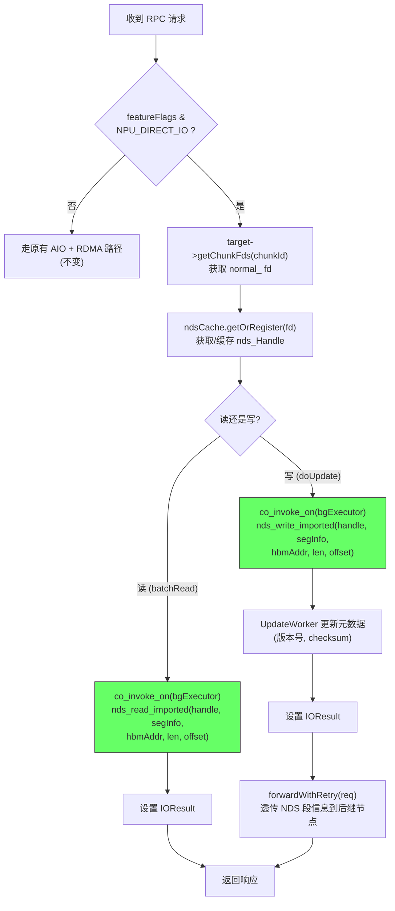

---

## 7. 关键设计决策

| 决策 | 选择 | 原因 |
|------|------|------|
| NDS 调用位置 | Storage Server 端 | chunk 文件 fd 在存储服务端 |
| 链式复制 | 全 NDS 链路 | 所有节点直接从 NPU HBM 读写，消除 RDMA |
| Chunk fd 选择 | `normal_` fd (O_RDWR\|O_SYNC) | NDS 硬件直通不依赖 O_DIRECT 对齐约束，无需对齐 offset/length |
| 向后兼容 | 通过 `isNpuDirect` / `NPU_DIRECT_IO` flag 区分 | 普通 RDMA 路径完全保留 |
| NDS 同步调用 | `co_invoke_on(bgExecutor)` | 避免阻塞协程线程 |
| 错误重试 | 与现有 RDMA 路径一致 | FUSE daemon 端 StorageClient 做指数退避重试 |
| Syncing 节点 | 初期不支持 | 要求链上所有节点 SERVING 状态 |

---

## 8. Checksum 处理方案

### 现有 checksum 流程（RDMA 路径）

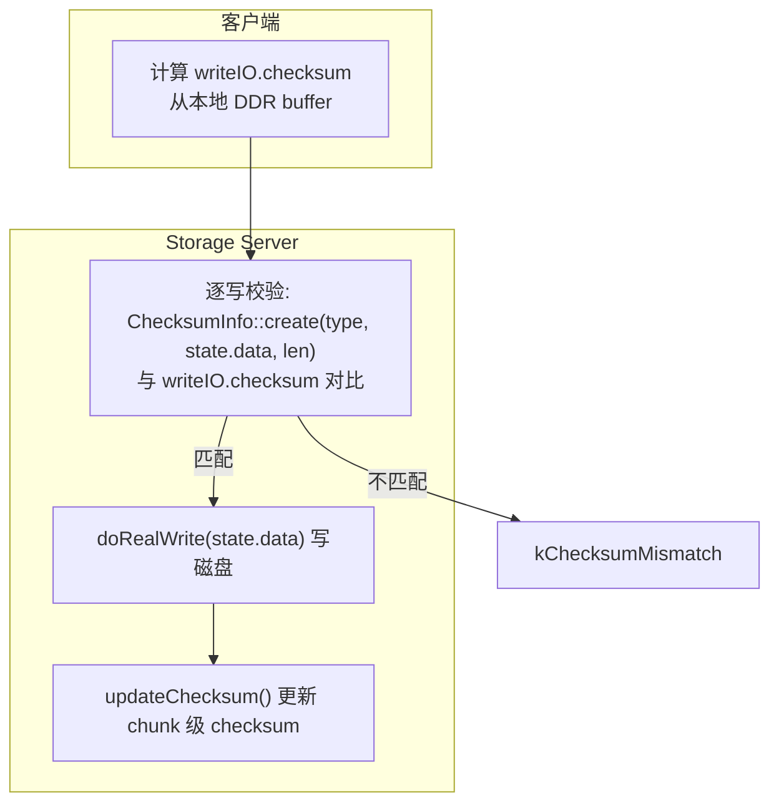

### NDS 直通 checksum 流程

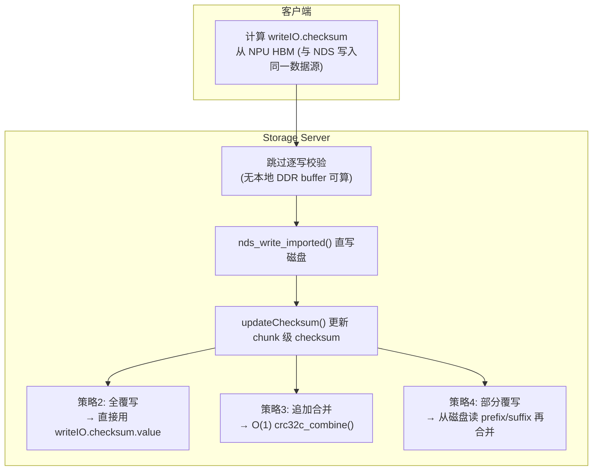

**关键点**：
- **逐写校验跳过**：NDS 模式下无本地 DDR buffer，无法调用 `ChecksumInfo::create(type, state.data, len)` 重算校验。NDS 硬件保证数据传输完整性，且客户端从同一 HBM 数据源计算 checksum，因此跳过此步骤是安全的。
- **chunk 级 checksum 更新**：`updateChecksum()` 的三种策略均不依赖本地 buffer：
  - 策略2（全覆写）：直接用客户端传来的 `writeIO.checksum.value`
  - 策略3（追加合并）：`crc32c_combine(existing, writeIO.checksum, writeIO.length)` — O(1) 数学运算
  - 策略4（部分覆写）：从磁盘 `pread()` 读取 prefix/suffix 数据再计算合并 — 与现有逻辑完全一致
- **代码改动**：`ChunkReplica::update()` 第193-207行的逐写校验需要跳过（`if (!isNpuDirect) { ... }`），其余 checksum 逻辑无需改动。

---

## 9. Chunk fd 选择说明

| fd 类型 | 打开标志 | 特点 | NDS 适用性 |
|---------|---------|------|-----------|
| `normal_` | O_RDWR \| O_SYNC | 使用页缓存，无对齐要求 | **选用**：NDS 硬件直通不依赖 O_DIRECT 对齐约束 |
| `direct_` | O_RDWR \| O_DIRECT | 绕过页缓存，需 512B 对齐 | 不选：NDS 调用方无法保证 offset/length 对齐 |

`getChunkFds()` 返回 `normal_` fd，通过 `nds_file_register(fd)` 注册后即可用于 `nds_read_imported` / `nds_write_imported`。
